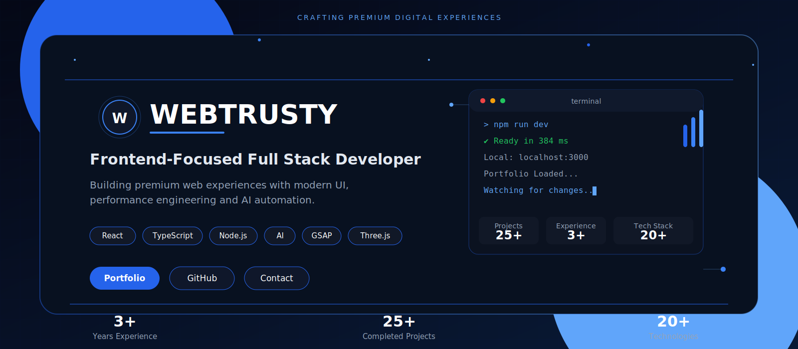
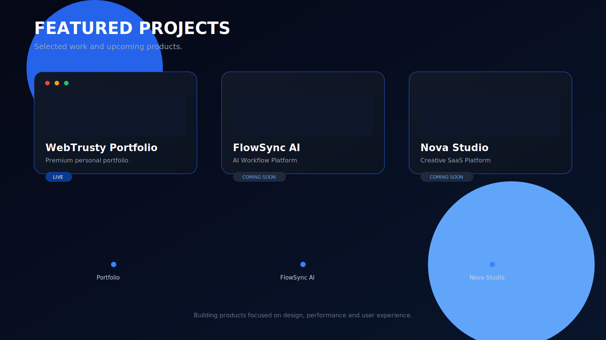

<!-- ===================================================== -->
<!-- HERO -->
<!-- ===================================================== -->

<h1 align="center">

WebTrusty

</h1>

<b>Frontend Developer</b> • <b>UI/UX Designer</b> • <b>Modern Web Experiences</b>

I build premium, fast and interactive websites with a strong focus on
clean UI, smooth animations and exceptional user experience.

<!-- ===================================================== -->
<!-- ABOUT -->
<!-- ===================================================== -->

## 💡 About Me

I'm a **Frontend Developer** focused on creating modern, responsive and high-performance web experiences.

My primary expertise is building beautiful interfaces with **React**, **TypeScript**, **Next.js**, **GSAP** and modern frontend technologies. I also work with backend technologies when needed to deliver complete web applications.

I enjoy transforming ideas into products that are fast, visually polished and user-friendly.

---

### What I Focus On

- 🎨 Premium UI & UX Design
- ⚡ High Performance Frontend Development
- 📱 Fully Responsive Websites
- ✨ Smooth Animations & Micro Interactions
- 🤖 AI Integration & Automation
- 🚀 Production Ready Deployments

---

### Current Goals

- Building premium web products
- Exploring AI-powered applications
- Contributing to open source
- Learning advanced frontend architecture
- Creating better developer experiences

<!-- ===================================================== -->
<!-- TECHNOLOGY -->
<!-- ===================================================== -->

## ⚙ Tech Stack

### Frontend

---

### Backend

---

### UI / Design

- GSAP
- Three.js
- Responsive Design
- Glassmorphism
- Modern UI Systems

---

### AI & Automation

- OpenAI API
- Groq API
- OpenRouter
- AI Automation
- Prompt Engineering

---

### Tools

---

## Development Philosophy

> Build fast.  
> Design clean.  
> Animate with purpose.  
> Ship quality.

<!-- ===================================================== -->
<!-- PROJECTS -->
<!-- ===================================================== -->

## 🚀 Featured Projects

<table>

<tr>

<td width="50%">

### 🌐 WebTrusty Portfolio

Modern portfolio built with a premium UI, smooth animations and responsive layouts.

**Highlights**

- React
- TypeScript
- GSAP
- Glassmorphism
- Responsive Design

**Live**

https://webtrusty.vercel.app

</td>

<td width="50%">

### 🏨 Aura Hotel

Luxury hotel landing page focused on premium visuals, booking experience and elegant UI.

**Highlights**

- React
- Modern UI
- Responsive
- Performance Optimized

**Live**

https://aura-hotel-demo.netlify.app/

</td>

</tr>

<tr>

<td width="50%">

### 🗼 Vintage Paris

Creative landing page inspired by luxury European aesthetics with modern frontend animations.

**Highlights**

- React
- GSAP
- Responsive
- Premium Visual Design

**Live**

https://vintage-paris-demo.netlify.app/

</td>

<td width="50%">

### 🤖 Discord Bots & AI

Advanced Discord bots featuring moderation, automation, music, AI integrations and custom systems.

**Highlights**

- discord.js
- Node.js
- AI APIs
- Automation
- Custom Commands

</td>

</tr>

</table>

---

## 💻 What I Build

- Premium Business Websites
- Landing Pages
- Portfolio Websites
- Dashboard Interfaces
- AI Powered Web Apps
- Discord Bots
- Automation Tools
- Modern UI Systems

